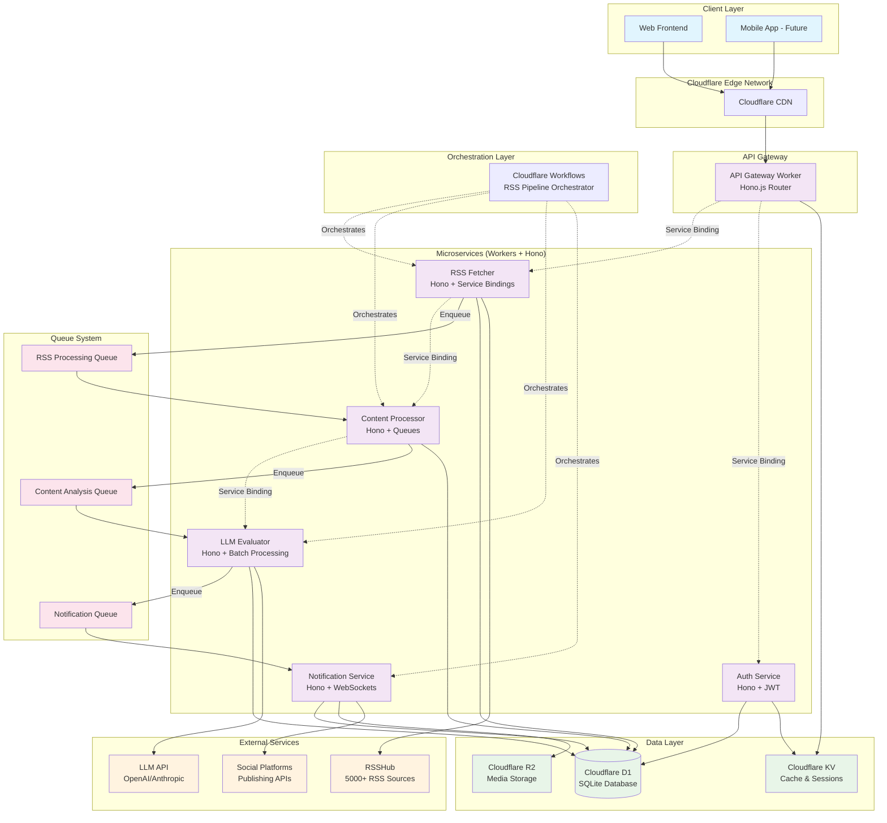

# Cloudflare D1 + Drizzle + Workers + Workflows Architecture Plan

## Architecture Overview

This document outlines a comprehensive architecture for the Cloudflare Agent Router AI routing platform using Cloudflare's serverless ecosystem. The system provides a complete LLM router solution with Cloudflare Workers for request routing, Containers for LiteLLM deployment, AI Gateway for traffic management, D1 for persistence, and Hono.js as the web framework to support AI agent endpoints like Claude Code.

### Architecture Diagram



### Communication Patterns

#### Service Bindings (Synchronous)

- **API Gateway ↔ Auth Service**: JWT validation and user authentication
- **API Gateway ↔ RSS Service**: Direct RSS subscription management
- **RSS Service ↔ Content Processor**: Immediate content normalization
- **Content Processor ↔ LLM Evaluator**: Real-time quality scoring

#### Queues (Asynchronous)

- **RSS Processing Queue**: Batch RSS content for efficient processing
- **Content Analysis Queue**: Queue content for LLM evaluation
- **Notification Queue**: Deliver notifications without blocking main flow

#### Workflows (Orchestration)

- **RSS Pipeline**: Coordinate entire RSS-to-notification flow
- **Error Handling**: Automatic retry with exponential backoff
- **Batch Optimization**: Collect and process content in efficient batches

## Current State Analysis

- **Existing**: Web Frontend in `apps/web` with mock data
- **Target**: AI agent router architecture with LLM routing workers, container-based LiteLLM services, AI Gateway integration, and intelligent request orchestration

## Enhanced Turborepo Structure

```
cloudflare-agent-router/
├── apps/
│   ├── web/                    # Web Frontend with D1 integration
│   ├── workers/
│   │   ├── api-gateway/        # Central API router (Hono.js)
│   │   ├── rss-fetcher/        # RSS polling service (Hono.js)
│   │   ├── content-processor/  # Content normalization (Hono.js)
│   │   ├── llm-evaluator/     # AI content scoring (Hono.js)
│   │   ├── notification/       # User notifications (Hono.js + WebSocket)
│   │   └── auth-service/       # Authentication service (Hono.js + JWT)
│   └── workflows/
│       ├── rss-pipeline/       # Main RSS processing workflow
│       └── batch-coordinator/  # Batch processing coordination
├── packages/
│   ├── database/              # Shared Drizzle schemas + client
│   ├── shared/                # Common types/utils/constants
│   ├── rsshub-client/         # RSSHub integration library
│   ├── hono-utils/            # Shared Hono.js utilities and middleware
│   └── queue-types/           # Queue message type definitions
└── infrastructure/
    ├── d1-setup/              # Database setup and migration scripts
    ├── wrangler-configs/      # Shared Wrangler configuration templates
    └── deployment/            # Deployment scripts and CI/CD workflows
```

### Package Dependencies and Structure

```typescript
// Root package.json workspace configuration
{
  "name": "cloudflare-agent-router",
  "private": true,
  "workspaces": [
    "apps/*",
    "apps/workers/*",
    "apps/workflows/*",
    "packages/*"
  ],
  "scripts": {
    "dev": "turbo run dev",
    "build": "turbo run build",
    "db:generate": "turbo run db:generate",
    "db:migrate": "turbo run db:migrate",
    "deploy:workers": "turbo run deploy --filter='./apps/workers/*'",
    "deploy:workflows": "turbo run deploy --filter='./apps/workflows/*'",
    "deploy:all": "pnpm run build && pnpm run deploy:workers && pnpm run deploy:workflows"
  },
  "devDependencies": {
    "turbo": "^2.3.0",
    "@cloudflare/workers-types": "^4.20241022.0",
    "wrangler": "^3.78.0"
  }
}

// Enhanced turbo.json with dependency management
{
  "tasks": {
    "build": {
      "dependsOn": ["^build", "db:generate"],
      "outputs": [".next/**", "dist/**", ".output/**", "build/**"]
    },
    "dev": {
      "dependsOn": ["^build", "db:generate"],
      "cache": false,
      "persistent": true
    },
    "db:generate": {
      "dependsOn": ["^build"],
      "inputs": ["src/schema/**"],
      "outputs": ["migrations/**"]
    },
    "db:migrate": {
      "dependsOn": ["db:generate"],
      "cache": false
    },
    "deploy": {
      "dependsOn": ["build"],
      "cache": false,
      "inputs": ["wrangler.toml", "src/**", "package.json"]
    },
    "lint": {
      "dependsOn": ["^build"]
    },
    "typecheck": {
      "dependsOn": ["^build", "db:generate"]
    }
  }
}
```

## 1. Shared Database Package (`packages/database`)

### Database Schema (Drizzle)

```typescript
// Users table
users: {
  ;(id, email, preferences, quota_used, created_at)
}

// RSS subscriptions per user
rss_subscriptions: {
  ;(id, user_id, rsshub_route, filters, active, created_at)
}

// Processed content with AI scores
content_items: {
  ;(id, url, title, excerpt, source, rsshub_route, ai_content_score, fetched_at, processed_at)
}

// Generated content tracking
generated_outputs: {
  ;(id, source_content_id, output_type, platform, status, created_at)
}

// Processing status and metadata
processing_status: {
  ;(id, content_id, status, error_message, attempts)
}
```

### Configuration Files

- `drizzle.config.ts` - D1 HTTP driver configuration
- `schema/` - Table definitions and relations
- `migrations/` - Auto-generated migration files
- `client.ts` - Shared database connection utility

```typescript
// packages/database/drizzle.config.ts

// packages/database/src/client.ts
import { drizzle } from 'drizzle-orm/d1'

import * as schema from './schema'

import type { Config } from 'drizzle-kit'

export default {
  schema: './src/schema/*',
  out: './migrations',
  driver: 'd1-http',
  dbCredentials: {
    accountId: process.env.CLOUDFLARE_ACCOUNT_ID!,
    databaseId: process.env.CLOUDFLARE_D1_DATABASE_ID!,
    token: process.env.CLOUDFLARE_API_TOKEN!,
  },
} satisfies Config

export type Database = ReturnType<typeof createDrizzleClient>

export function createDrizzleClient(d1: D1Database) {
  return drizzle(d1, { schema })
}

export * from './schema'
export { sql } from 'drizzle-orm'
```

## 2. Microservice Workers Architecture (Hono.js Framework)

### API Gateway Worker (`apps/workers/api-gateway`)

**Purpose**: Central API router and authentication gateway

- **Framework**: Hono.js with TypeScript
- **Features**: JWT middleware, CORS handling, rate limiting
- **Service Bindings**: Direct connections to Auth and RSS services
- **Routes**: `/api/auth/*`, `/api/rss/*`, `/api/content/*`, `/api/user/*`

**Configuration (`wrangler.jsonc`)**:

```json
{
  "name": "api-gateway",
  "main": "src/index.ts",
  "compatibility_date": "2024-04-01",
  "services": [
    {
      "binding": "AUTH_SERVICE",
      "service": "auth-service"
    },
    {
      "binding": "RSS_SERVICE",
      "service": "rss-fetcher"
    }
  ],
  "d1_databases": [
    {
      "binding": "DATABASE",
      "database_name": "cloudflare-agent-router-db",
      "database_id": "your-database-id"
    }
  ],
  "kv_namespaces": [
    {
      "binding": "KV",
      "id": "your-kv-id"
    }
  ],
  "vars": {
    "ENVIRONMENT": "development"
  }
}
```

```typescript
// Example Hono.js API Gateway structure
import { Hono } from 'hono'
import { cors } from 'hono/cors'
import { jwt } from 'hono/jwt'

const app = new Hono<{
  Bindings: {
    AUTH_SERVICE: Service
    RSS_SERVICE: Service
    DATABASE: D1Database
    KV: KVNamespace
  }
}>()

app.use('*', cors())
app.use('/api/protected/*', jwt({ secret: 'your-secret' }))

app.route('/api/auth', authRouter)
app.route('/api/rss', rssRouter)
app.route('/api/content', contentRouter)
```

### RSS Fetcher Worker (`apps/workers/rss-fetcher`)

**Purpose**: Poll RSSHub endpoints and store raw content

- **Framework**: Hono.js with scheduled triggers
- **Trigger**: Cron schedule (every 15-30 minutes) + Manual API calls
- **Process**: Query active subscriptions → Call RSSHub → Store raw content → Enqueue for processing
- **Communication**: Service bindings to Content Processor, Queues for batch processing
- **Output**: New content records in D1 + Queue messages

**Configuration (`wrangler.jsonc`)**:

```json
{
  "name": "rss-fetcher",
  "main": "src/index.ts",
  "compatibility_date": "2024-04-01",
  "services": [
    {
      "binding": "CONTENT_PROCESSOR",
      "service": "content-processor"
    }
  ],
  "queues": {
    "producers": [
      {
        "binding": "RSS_QUEUE",
        "queue": "rss-processing"
      }
    ]
  },
  "d1_databases": [
    {
      "binding": "DATABASE",
      "database_name": "cloudflare-agent-router-db",
      "database_id": "your-database-id"
    }
  ],
  "triggers": {
    "crons": ["*/15 * * * *"]
  }
}
```

```typescript
// RSS Fetcher with Hono.js
import { Hono } from 'hono'

const app = new Hono<{
  Bindings: {
    CONTENT_PROCESSOR: Service
    RSS_QUEUE: Queue
    DATABASE: D1Database
  }
}>()

app.post('/fetch-rss', async (c) => {
  const subscriptions = await getActiveSubscriptions(c.env.DATABASE)

  for (const sub of subscriptions) {
    const content = await fetchFromRSSHub(sub.rsshub_route)
    await storeRawContent(c.env.DATABASE, content)

    // Use Service Binding for immediate processing
    await c.env.CONTENT_PROCESSOR.fetch('/process', {
      method: 'POST',
      body: JSON.stringify({ contentId: content.id }),
    })
  }
})
```

### Content Processor Worker (`apps/workers/content-processor`)

**Purpose**: Normalize and extract structured data

- **Framework**: Hono.js with queue consumers
- **Trigger**: Service bindings from RSS Fetcher + Queue consumers
- **Process**: Parse RSS content → Extract title/excerpt → Deduplicate → Enqueue for LLM
- **Communication**: Service bindings from RSS Fetcher, Queue to LLM Evaluator
- **Output**: Processed content ready for evaluation

**Configuration (`wrangler.jsonc`)**:

```json
{
  "name": "content-processor",
  "main": "src/index.ts",
  "compatibility_date": "2024-04-01",
  "services": [
    {
      "binding": "LLM_EVALUATOR",
      "service": "llm-evaluator"
    }
  ],
  "queues": {
    "consumers": [
      {
        "queue": "rss-processing",
        "max_batch_size": 10,
        "max_batch_timeout": 30
      }
    ],
    "producers": [
      {
        "binding": "ANALYSIS_QUEUE",
        "queue": "content-analysis"
      }
    ]
  },
  "d1_databases": [
    {
      "binding": "DATABASE",
      "database_name": "cloudflare-agent-router-db",
      "database_id": "your-database-id"
    }
  ]
}
```

```typescript
// Content Processor with dual triggers
import { Hono } from 'hono'

const app = new Hono<{
  Bindings: {
    LLM_EVALUATOR: Service
    ANALYSIS_QUEUE: Queue
    DATABASE: D1Database
  }
}>()

// Service Binding endpoint (synchronous)
app.post('/process', async (c) => {
  const { contentId } = await c.req.json()
  const processed = await processContent(contentId)

  // Queue for batch LLM processing
  await c.env.ANALYSIS_QUEUE.send({ contentId: processed.id })

  return c.json({ success: true, contentId: processed.id })
})

// Queue consumer (asynchronous)
export default {
  async queue(batch, env) {
    for (const message of batch.messages) {
      await processContentFromQueue(message.body, env)
    }
  },
}
```

### LLM Evaluator Worker (`apps/workers/llm-evaluator`)

**Purpose**: Score content for AI generation quality using batch processing

- **Framework**: Hono.js with intelligent batching
- **Trigger**: Queue consumer with batch optimization
- **Process**: Collect content batches → LLM API call → Score and store → Trigger notifications
- **Communication**: Queue from Content Processor, Service binding to Notification
- **Output**: Content with AI quality scores + Notification triggers

```typescript
// LLM Evaluator with batch processing
import { Hono } from 'hono'

const app = new Hono<{
  Bindings: {
    NOTIFICATION_SERVICE: Service
    NOTIFY_QUEUE: Queue
    DATABASE: D1Database
    LLM_API_KEY: string
  }
}>()

export default {
  async queue(batch, env) {
    // Batch processing for efficiency
    const contentItems = await getBatchContent(batch.messages, env.DATABASE)
    const scores = await evaluateContentBatch(contentItems, env.LLM_API_KEY)

    await updateContentScores(scores, env.DATABASE)

    // Notify for high-quality content
    const highQualityContent = scores.filter((s) => s.score > 0.8)
    for (const content of highQualityContent) {
      await env.NOTIFY_QUEUE.send({
        type: 'high_quality_content',
        contentId: content.id,
        score: content.score,
      })
    }
  },
}
```

### Notification Worker (`apps/workers/notification`)

**Purpose**: Update users with new high-quality content and manage real-time updates

- **Framework**: Hono.js with WebSocket support
- **Trigger**: Queue from LLM Evaluator + WebSocket connections
- **Process**: Filter by user preferences → Send notifications → Update frontend
- **Communication**: Queue consumer + WebSocket connections + Social API integrations
- **Output**: User notifications, frontend updates, social media posts

```typescript
// Notification Service with WebSocket support
import { Hono } from 'hono'
import { upgradeWebSocket } from 'hono/cloudflare-workers'

const app = new Hono<{
  Bindings: {
    DURABLE_OBJECT: DurableObjectNamespace
    R2_BUCKET: R2Bucket
    DATABASE: D1Database
  }
}>()

app.get(
  '/ws',
  upgradeWebSocket((c) => ({
    onMessage: async (evt, ws) => {
      // Handle real-time subscriptions
    },
    onClose: () => {
      // Cleanup connections
    },
  }))
)

export default {
  async queue(batch, env) {
    for (const message of batch.messages) {
      const { type, contentId, score } = message.body

      if (type === 'high_quality_content') {
        await notifySubscribedUsers(contentId, score, env)
        await updateRealtimeClients(contentId, env)
      }
    }
  },
}
```

### Auth Service Worker (`apps/workers/auth-service`)

**Purpose**: Handle user authentication, authorization, and session management

- **Framework**: Hono.js with JWT middleware
- **Features**: Login/register, JWT token management, user preferences
- **Communication**: Service bindings from API Gateway, KV for session storage
- **Output**: JWT tokens, user session data, preference management

```typescript
// Auth Service with Hono.js
import { Hono } from 'hono'
import { jwt, sign, verify } from 'hono/jwt'

const app = new Hono<{
  Bindings: {
    DATABASE: D1Database
    KV: KVNamespace
    JWT_SECRET: string
  }
}>()

app.post('/login', async (c) => {
  const { email, password } = await c.req.json()
  const user = await authenticateUser(email, password, c.env.DATABASE)

  if (user) {
    const token = await sign(
      { sub: user.id, exp: Math.floor(Date.now() / 1000) + 86400 },
      c.env.JWT_SECRET
    )
    await c.env.KV.put(
      `session:${user.id}`,
      JSON.stringify({ userId: user.id, lastActive: Date.now() })
    )

    return c.json({ token, user: { id: user.id, email: user.email } })
  }

  return c.json({ error: 'Invalid credentials' }, 401)
})
```

## 3. Cloudflare Workflows Orchestration

### RSS Pipeline Workflow (`apps/workflows/rss-pipeline`)

**Durable Execution Chain with Service Binding Integration**:

```typescript
// RSS Pipeline Workflow with Hono.js coordination
import { WorkflowEntrypoint, WorkflowStep } from 'cloudflare:workers'

export class RSSPipelineWorkflow extends WorkflowEntrypoint {
  async run(event, step: WorkflowStep) {
    // Step 1: Schedule RSS Fetching (every 15 minutes)
    const rssResults = await step.do('fetch-rss-content', async () => {
      const response = await this.env.RSS_FETCHER.fetch('/fetch-rss', {
        method: 'POST',
        headers: { 'Content-Type': 'application/json' },
      })
      return await response.json()
    })

    // Step 2: Process Content (Service Binding - Immediate)
    const processedContent = await step.do('process-content', async () => {
      const results = []
      for (const contentId of rssResults.contentIds) {
        const response = await this.env.CONTENT_PROCESSOR.fetch('/process', {
          method: 'POST',
          body: JSON.stringify({ contentId }),
        })
        results.push(await response.json())
      }
      return results
    })

    // Step 3: Batch LLM Evaluation (Queue-based for efficiency)
    const evaluationResults = await step.do('evaluate-content-batch', async () => {
      // Queue all content for batch processing
      for (const content of processedContent) {
        await this.env.ANALYSIS_QUEUE.send({
          contentId: content.contentId,
          batchId: event.batchId,
        })
      }

      // Wait for batch completion (using Durable Object for coordination)
      return await this.waitForBatchCompletion(event.batchId)
    })

    // Step 4: Trigger Notifications (Service Binding for immediate user updates)
    await step.do('send-notifications', async () => {
      const highQualityContent = evaluationResults.filter((c) => c.score > 0.8)

      for (const content of highQualityContent) {
        await this.env.NOTIFICATION_SERVICE.fetch('/notify', {
          method: 'POST',
          body: JSON.stringify({
            type: 'high_quality_content',
            contentId: content.id,
            score: content.score,
          }),
        })
      }
    })

    // Step 5: Error Recovery and Monitoring
    await step.do('update-metrics', async () => {
      await this.env.METRICS_SERVICE.fetch('/record', {
        method: 'POST',
        body: JSON.stringify({
          pipelineRun: event.id,
          contentProcessed: processedContent.length,
          highQualityCount: evaluationResults.filter((c) => c.score > 0.8).length,
          completedAt: new Date().toISOString(),
        }),
      })
    })
  }

  private async waitForBatchCompletion(batchId: string): Promise<any[]> {
    // Use Durable Object to coordinate batch completion
    const batchCoordinator = this.env.BATCH_COORDINATOR.get(
      this.env.BATCH_COORDINATOR.idFromName(batchId)
    )

    const response = await batchCoordinator.fetch('/wait-completion', {
      method: 'POST',
      body: JSON.stringify({ batchId }),
    })

    return await response.json()
  }
}

// Workflow configuration
export default {
  async scheduled(event, env, ctx) {
    // Trigger the workflow every 15 minutes
    const workflowId = `rss-pipeline-${Date.now()}`
    await env.RSS_PIPELINE_WORKFLOW.create({
      id: workflowId,
      params: {
        batchId: `batch-${Date.now()}`,
        scheduledAt: new Date().toISOString(),
      },
    })
  },
}
```

### Workflow Benefits with Enhanced Architecture:

- **Service Binding Integration**: Zero-latency communication for immediate processing
- **Queue Optimization**: Batch processing for cost-effective LLM calls
- **Durable State**: Automatic retry with exponential backoff and state persistence
- **Coordinated Execution**: Orchestrate complex multi-service operations
- **Error Recovery**: Built-in retry mechanisms with detailed logging
- **Cost Optimization**: Intelligent batching reduces API calls and improves efficiency
- **Monitoring Integration**: Built-in metrics and observability

### Advanced Workflow Features:

````typescript
// Enhanced workflow with conditional execution
export class ConditionalRSSWorkflow extends WorkflowEntrypoint {
  async run(event, step: WorkflowStep) {
    // Conditional processing based on content volume
    const contentVolume = await step.do('assess-volume', async () => {
      const stats = await this.env.DATABASE.prepare(
        'SELECT COUNT(*) as pending FROM content_items WHERE processed_at IS NULL'
      ).first()
      return stats.pending
    })

    if (contentVolume > 100) {
      // High volume: Use batch processing
      await this.executeBatchPipeline(step)
    } else {
      // Low volume: Use real-time processing
      await this.executeRealtimePipeline(step)
    }
  }

  private async executeBatchPipeline(step: WorkflowStep) {
    // Optimized for high-volume processing
    await step.do('batch-process', async () => {
      // Implementation for batch processing
    })
  }

  private async executeRealtimePipeline(step: WorkflowStep) {
    // Optimized for real-time responsiveness
    await step.do('realtime-process', async () => {
      // Implementation for real-time processing
    })
  }
}

## 4. Web Frontend Integration

### Database Integration
- Update `apps/web/wrangler.jsonc` with D1 bindings
- Replace mock data with Drizzle queries
- Add database package dependency
- Create API routes for user management

### Real-time Updates
- Use Cloudflare Durable Objects for WebSocket connections
- Push new content to frontend as it's processed
- Implement user preference management
- Add subscription management UI

## 5. Configuration Updates

### Root Package.json Configuration
```json
{
  "name": "cloudflare-agent-router",
  "private": true,
  "workspaces": [
    "apps/*",
    "apps/workers/*",
    "apps/workflows/*",
    "packages/*"
  ],
  "scripts": {
    "dev": "turbo run dev",
    "build": "turbo run build",
    "db:generate": "turbo run db:generate",
    "db:migrate": "turbo run db:migrate",
    "deploy:workers": "turbo run deploy --filter='./apps/workers/*'",
    "deploy:workflows": "turbo run deploy --filter='./apps/workflows/*'",
    "deploy:all": "pnpm run build && pnpm run deploy:workers && pnpm run deploy:workflows"
  },
  "devDependencies": {
    "turbo": "^2.3.0",
    "@cloudflare/workers-types": "^4.20241022.0",
    "wrangler": "^3.78.0"
  },
  "packageManager": "pnpm@10.12.4"
}
````

### Turbo.json Configuration

```json
{
  "tasks": {
    "build": {
      "dependsOn": ["^build", "db:generate"],
      "outputs": [".next/**", "dist/**", ".output/**", "build/**"]
    },
    "dev": {
      "dependsOn": ["^build", "db:generate"],
      "cache": false,
      "persistent": true
    },
    "db:generate": {
      "dependsOn": ["^build"],
      "inputs": ["src/schema/**"],
      "outputs": ["migrations/**"]
    },
    "db:migrate": {
      "dependsOn": ["db:generate"],
      "cache": false
    },
    "deploy": {
      "dependsOn": ["build"],
      "cache": false,
      "inputs": ["wrangler.jsonc", "src/**", "package.json"]
    },
    "lint": {
      "dependsOn": ["^build"]
    },
    "typecheck": {
      "dependsOn": ["^build", "db:generate"]
    }
  }
}
```

## 6. Development Workflow

### Setup Process

1. **Create D1 Database**: `wrangler d1 create cloudflare-agent-router-db`
2. **Generate Schemas**: `pnpm db:generate`
3. **Run Migrations**: `pnpm db:migrate`
4. **Local Development**: `pnpm dev` (all services)
5. **Deploy**: `pnpm deploy:workers && pnpm deploy:workflows`

### Enhanced Local Development

#### Multi-Worker Development Setup

For local development with service bindings, you'll need to run multiple `wrangler dev` sessions:

```bash
# Terminal 1 - Auth Service
cd apps/workers/auth-service
wrangler dev --port 8781

# Terminal 2 - RSS Fetcher
cd apps/workers/rss-fetcher
wrangler dev --port 8782

# Terminal 3 - Content Processor
cd apps/workers/content-processor
wrangler dev --port 8783

# Terminal 4 - API Gateway (main entry point)
cd apps/workers/api-gateway
wrangler dev --port 8787
```

#### Service Binding Status Monitoring

When running `wrangler dev`, you'll see service binding connection status:

```bash
$ wrangler dev
Your worker has access to the following bindings:
- Services:
  - AUTH_SERVICE: auth-service [connected]
  - RSS_SERVICE: rss-fetcher [connected]
- D1 Databases:
  - DATABASE: cloudflare-agent-router-db (local)
```

#### Alternative: Single Command Multi-Worker Setup

You can also run multiple workers with one command (experimental):

```bash
# From project root
wrangler dev -c apps/workers/api-gateway/wrangler.jsonc \
             -c apps/workers/auth-service/wrangler.jsonc \
             -c apps/workers/rss-fetcher/wrangler.jsonc
```

#### Development Environment Variables

Create `.dev.vars` files in each worker directory:

```bash
# apps/workers/api-gateway/.dev.vars
JWT_SECRET=your-dev-jwt-secret
ENVIRONMENT=development

# apps/workers/rss-fetcher/.dev.vars
RSSHUB_BASE_URL=https://rsshub.app
```

### Package Manager

- **Primary**: pnpm for all package installations and management
- **Workspaces**: Configured for pnpm workspace support
- **Commands**: All scripts use pnpm instead of npm/yarn

### Cost Optimization

- **D1**: 100K reads/day free (sufficient for MVP)
- **Workers**: 100K invocations/month free
- **Workflows**: Built on Workers, same free tier
- **Main Cost**: LLM API calls (optimized via batching)

## 7. Implementation Phases

**Phase 1: Foundation**

- Set up shared database package
- Create basic D1 schema
- Update Web Frontend for database integration

**Phase 2: Core Workers**

- Implement RSS Fetcher worker
- Create Content Processor worker
- Basic workflow orchestration

**Phase 3: AI Integration**

- Add LLM Evaluator worker
- Implement content scoring
- Connect to existing UI

**Phase 4: Production**

- Add monitoring and logging
- Implement user management
- Deploy and optimize

This architecture provides a scalable, cost-effective foundation for the AI agent router platform with clear separation of concerns, intelligent LLM routing, and automatic orchestration supporting Claude Code and other AI development tools.

## 8. Future Plans

### Advanced Performance Optimizations

- **Smart Placement**: Configure backend workers to run closer to data sources for reduced latency
- **Advanced Caching**: Implement Cache API strategies for RSS content and KV caching for user sessions
- **Connection Pooling**: Optimize external API connections and database queries

### Enhanced Error Handling & Reliability

- **Circuit Breaker Patterns**: Prevent cascading failures when external services are unavailable
- **Exponential Backoff**: Intelligent retry logic with progressive delays
- **Dead Letter Queues**: Handle permanently failed messages with proper alerting

### Security & Monitoring

- **Rate Limiting**: Implement per-user and per-endpoint rate limiting
- **CORS Policies**: Fine-grained cross-origin resource sharing controls
- **Observability**: Analytics Engine integration for monitoring and alerting
- **Health Checks**: Automated endpoint health monitoring

### Production Deployment

- **Multi-Environment**: Staging and production environment configurations
- **Blue-Green Deployments**: Zero-downtime deployment strategies
- **CI/CD Integration**: Automated testing and deployment pipelines
- **Rollback Strategies**: Automated rollback for failed deployments

### Advanced Features

- **WebSocket Scaling**: Durable Objects for real-time features
- **Content Delivery**: R2 integration for media storage and CDN
- **Analytics**: User behavior tracking and performance metrics
- **A/B Testing**: Content recommendation algorithm testing

## Package Installation Commands

All package installations will use pnpm:

```bash
# Install dependencies
pnpm install

# Add new packages
pnpm add [package-name]

# Add dev dependencies
pnpm add -D [package-name]

# Install in specific workspace
pnpm add [package-name] --filter [workspace-name]

# Drizzle ORM setup
pnpm add drizzle-orm
pnpm add -D drizzle-kit

# Cloudflare Workers dependencies
pnpm add -D @cloudflare/workers-types wrangler
```
